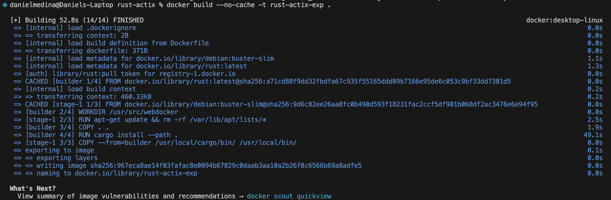
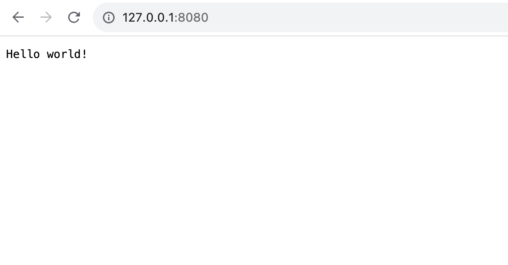

# Rust Actix Web Application
This README covers the basic logic of a simple Rust Actix web application, its containerization, building the Docker image, and running the container locally.

## App Logic
The Rust Actix web application demonstrates simple web server functionality with the following endpoints:

- **GET /:** Returns a simple greeting, "Hello world!".
- **POST /echo:** Echoes back the body of the request prefixed with "Hello, ". For example, sending "Actix" in the request body will return "Hello, Actix!".
- **GET /hey:** Returns a static message, "Hey there!".
This application is an example of using Rust's powerful Actix web framework to create asynchronous web servers with minimal effort.

## Containerization
Containerization involves packaging the web application along with its environment and dependencies into a Docker container. This approach ensures consistency across different environments, simplifying deployment and scaling.

## Building the Docker Image
The Docker image for this application was built using a multi-stage Dockerfile process, which includes:

Building Stage: Uses the official Rust Docker image as a base to compile the web application, taking advantage of Rust's cargo build system for dependency management and compilation.

Runtime Stage: Uses a slim version of the Debian Docker image for a minimal runtime environment. The compiled binary from the building stage is copied over to this stage, reducing the overall image size and removing unnecessary build tools and dependencies from the runtime environment.

## Running the Container Locally
To run the Docker container locally, execute the following command after building your Docker image:

docker run -d -p 8080:8080 --name my-rust-actix-app rust-actix-exp

This command runs the container in detached mode, maps port 8080 of the container to port 8080 on the host, and names the container my-rust-actix-app.

After the container is running, you can access the web application through http://localhost:8080 and use the defined endpoints.
